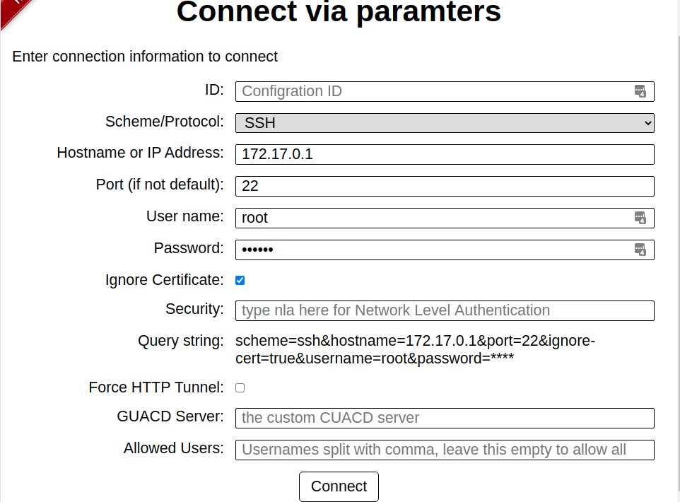
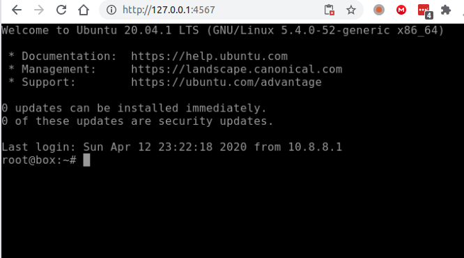
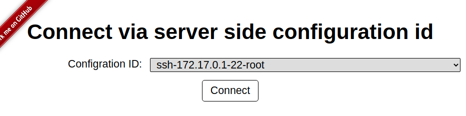
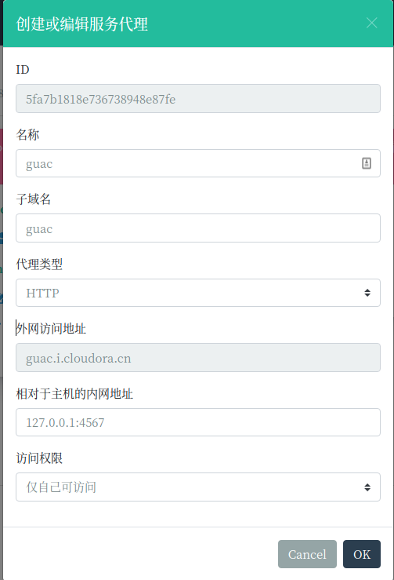

#　Guac Vue　客户端

## 主要特性

采用轻两级的客户端[Guac Go客户端](https://github.com/EdgoraCN/guac)连接[Guacamole Guacd服务端](https://hub.docker.com/r/guacamole/guacd)

* 轻量级，全部服务仅需要４０Ｍ内存

* 部署简单，支持docker

* 无需数据库，采用yaml配置文件保存远程链接信息

* 支持Basic Auth认证和自定义http header认证

* 简单易用ＷＥＢ界面，支持api读写操作

* 自动保存连接信息到ｙａｍｌ配置文件

* 支持与Ｅｄｇｏｒａ权限集成，可以多帐号使用

##　安装部署

* 生成配置文件

 1. `guacd.address` 留空，后面会在环境变量里面设置

 2. `server.auth.basic.username` 和　`server.auth.basic.password` 可以根据需要修改，　留空则关闭basic认证

 3. `server.auth.header.name` 留空则关闭自定义请求头认证，　`server.auth.header.ｖalues` 是允许访问值，留空则任何值都可以访问

 4. `conns` 可以留空，在界面上进行连接的时，会自动保存到这里

```yaml
cat >> config.yaml <<EOL

guacd:
  address:
  override: true
log:
  level: INFO
server:
  api:
    ids: true
    list: true
    read: true
    delete: true
    update: true
  auth:
    basic:
      username: guac
      password: guac
      realm: Guac Server
    header:
      name: X-Forwarded-User
      values: []
  static:
    path: ./static
conns:

EOL
```

* 安装Guacd

```bash
docker rm -f guacd
docker run --name guacd --restart=always -d -p 4822:4822 guacamole/guacd
```

* 安装Guac

```bash
docker rm -f guac
docker run -d --name guac --restart=always -p 4567:4567 \
--link guacd:guacd \
-e GUACD=guacd:4822 \
-v `pwd`/config.yaml:/app/config.yaml \
edgora/guac:1.3.2
```

## 快速连接服务器

* 打开浏览器，在登录框中填入`server.auth.basic.username` 和　`server.auth.basic.password`

* 填入连接信息，点击`Connect`按钮

 1. `ID`用于标识连接信息，不填写会自动生成

 2. `GUACD Server`　单独为本连接指定GUACD, 留空则使用默认

 3. `Allowed Users` 允许使用此连接的帐号，用英文逗号隔开,不填写则所有登录用户都可以使用



* 开始打开远程控制，



* 查看`config.yaml`,里面添加一条记录，并产生生成了ID

```yaml
guacd:
  address: 127.0.0.1:4822
  override: true
log:
  level: INFO
server:
  api:
    ids: true
    list: true
    read: true
    delete: true
    update: true
  auth:
    basic:
      username: guac
      password: guac
      realm: Guac Server
    header:
      name: X-Forwarded-User
      values: []
  static:
    path: ./static
conns:
- hostname: 172.17.0.1
  id: ssh-172.17.0.1-22-root
  ignore-cert: "true"
  password: "******"
  port: "22"
  scheme: ssh
  username: root
```

## 使用已经保存的连接

* 选择已经保存的连接，点击`Connect`按钮



## 集成Edgora控制台

* 参照[虚拟网络](custom-navbar.md)创建http服务代理
 
 1. 为本地guac服务器地址`127.0.0.1:4567`
 2. 可将访问权限设置为`仅自己可以访问`



* 如需多帐号访问，可以访问权限设置为`所有登录用户可访问`, 同时在`config.yaml`中将允许访问的帐号写入`server.auth.header.ｖalues`

```yaml
server:
  auth:
    header:
      name: X-Forwarded-User
      values: ["username1","username2"]
```

* 如需限制某个连接的帐号的使用权限，可以将帐号写入连接的access属性，　如下连接只有`username1`和`username２`可以使用

```yaml
- hostname: 172.17.0.1
  id: ssh-172.17.0.1-22-root
  ignore-cert: "true"
  password: "******"
  port: "22"
  scheme: ssh
  username: root
  access: username1,username2
```